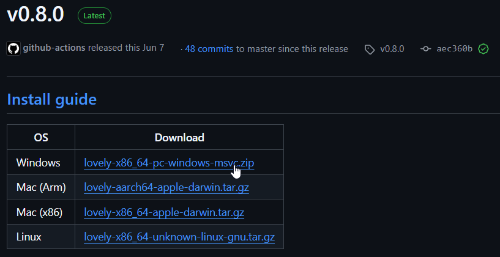
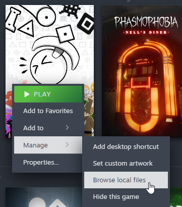
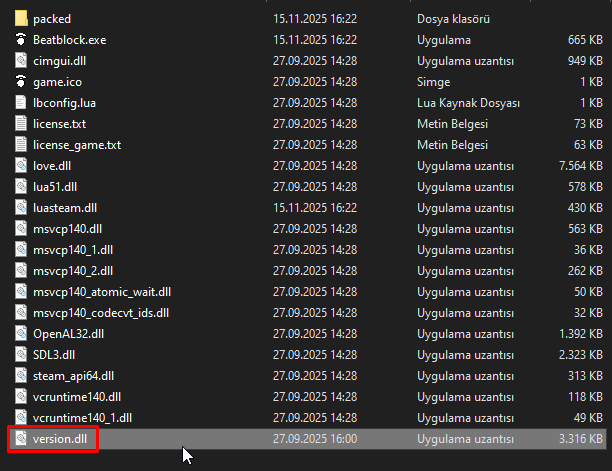
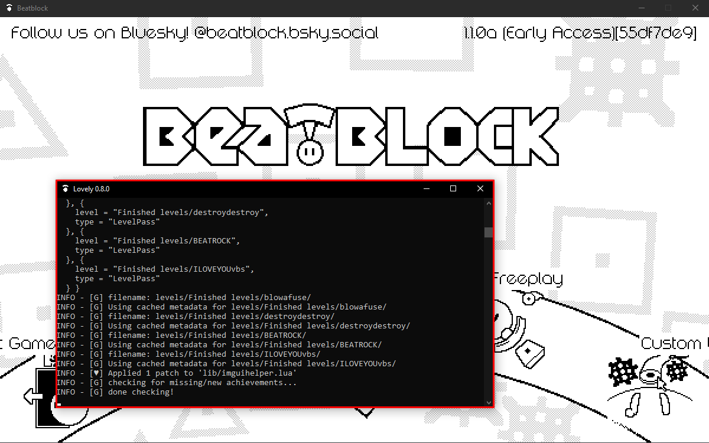
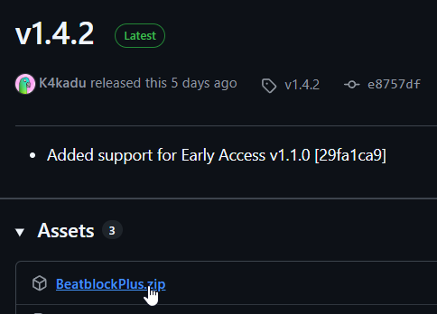
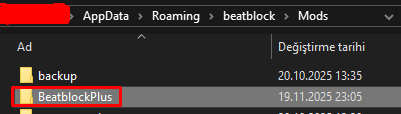
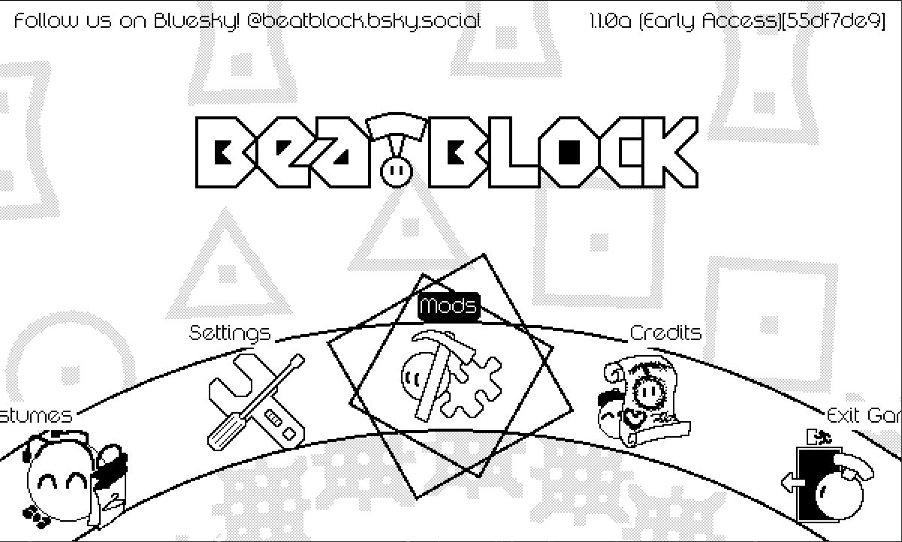

# Installing Lovely Injector and BB+

This page covers the installation of **Lovely Injector** and **Beatblock Plus**.

## What are they?

- **Lovely Injector** is a runtime Lua injector for LÖVE2D, the game framework Beatblock uses. It allows us to inject our own code into the game.
- **Beatblock Plus** is a mod loader that provides utilities for mod developers and an ingame configuration menu for users.

<u>You need to have both of them installed.</u>

## Installing Lovely Injector

1) Download the latest version of [lovely-injector](https://github.com/ethangreen-dev/lovely-injector/releases/latest).

2) Navigate to your Beatblock's installation folder.

3) Drag the `version.dll` file inside lovely-injector to your game's installation folder.

4) Launch the game. Make sure it also runs a terminal along with the game.

If you see the terminal, that means you've successfully installed lovely-injector! Now for Beatblock Plus.

## Installing Beatblock Plus

1) Download the latest version of [Beatblock Plus](https://github.com/BeatblockTools/BeatblockPlus/releases/latest)

2) Open your game's save directory.

For Windows:
    - Press `Win + R`
    - Type `%appdata%\beatblock` and hit enter

For Linux:
    - Open your file manager
    - Press `Ctrl + H` to view hidden folders
    - Go to your home directory
    - Navigate to `~/.local/share/beatblock`

For MacOS:
    - Open Finder
    - Press `Command + Shift + G`
    - Type `~/Library/Application Support/beatblock` and hit enter

3) Drag the Beatblock Plus folder inside the Mods folder

4) When you launch the game, you should see a 'Mods' button in the main menu.

That's all! You are now ready to download community made mods.
