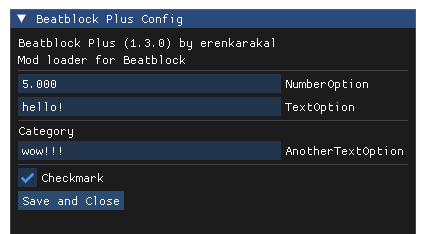
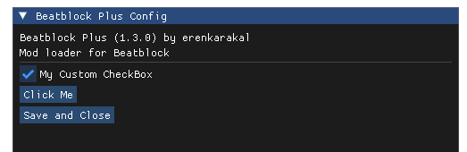

# Creating a Mod Config

There are 2 ways to create a config for your mod.

# Basic Configuration
This should be used when you only need text, number, and boolean fields. Simply add the values to your `mod.json` file, and they will appear in-game.
```jsx title="Mods/my-very-own-mod/mod.json"
{
  "id": "beatblock-plus",
  "name": "Beatblock Plus",
  "description": "Mod loader for Beatblock",
  "author": "erenkarakal",
  "version": "1.3.0",
  "enabled": true,
  "config": {
    "NumberOption": 5,
    "TextOption": "hello!",
    "Checkmark": true,
    "Category": {
      "AnotherTextOption": "wow!!!"
    }
  }
}
```


To access the value: `mods["beatblock-plus"].config.NumberOption`

# Advanced Configuration
Should be used when you need complex elements that aren't available in the basic configuration. Gives you full control over the ImGui renderer.\
It can't be used together with the basic configuration! You must pick one.\
Create a file named `config.lua` inside `Mods/your-mod/` and render the ImGui elements in it.
```jsx title="Mods/my-very-own-mod/config.lua"
mod.config.MyCustomCheckBox = helpers.InputBool("My Custom CheckBox", (mod.config.MyCustomCheckBox or true))

if imgui.Button("Click Me") then
  print("I was clicked!")
end
```

