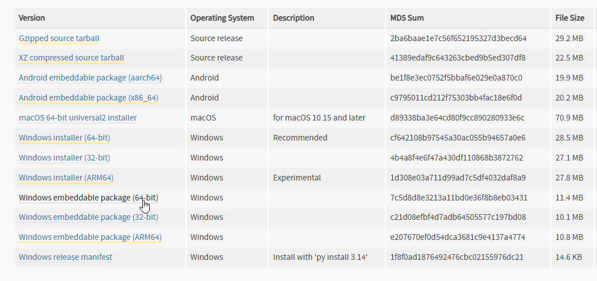
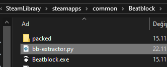
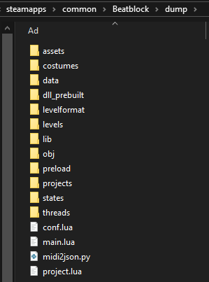

# Extracting Game Files

Having access to the game's files is very important for modding.\
However, Beatblock keeps half of the game's files in the `packed` folder and the other half in the .exe file, and some of the files are zipped which can get messy when looking through it.\
To not go through the hassle every game update, we prepared a Python script that does this for you.

## Installing Python

If you already have Python installed, you can skip this step.

1) Go to the download page of [latest Python](https://www.python.org/downloads/latest).

2) Scroll down and pick the version for your operating system. You can pick the "embeddable" version if you want it portable.



3) If you downloaded the embeddable version, make sure to unzip it.

## Using the Script

1) Download the [`bb-extractor` script](https://gist.github.com/erenkarakal/4bc1aca3c36fba3f4854a72d800a59a5) and place it in your game's installation folder.



2) Run it using the `python bb-extractor.py` command.\
If you are using the embeddable version, navigate to your Python folder and then run
```
.\python.exe "D:\SteamLibrary\steamapps\common\Beatblock\bb-extractor.py"
```
(You will need to tweak the command depending on your game's installation folder)

3) After a few seconds, the script will be completed and you will see all of the game's files in the `dump` folder.




::::danger[Warning]
You should never share the contents of the game's files publicly, including the `dump` folder.
::::
