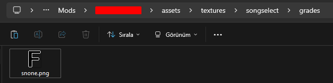
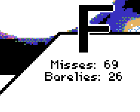
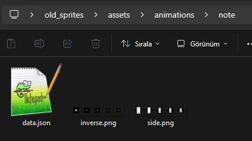

# Injecting Assets

This guide covers the usage of BeatblockPlus' asset injector.

# Figuring out the correct path
To inject your assets correctly. You must know how Lua's tables work. It won't be covered in this guide as there are thousands of Lua guides online.\
Beatblock loads all assets into a table when the game starts, and BB+'s asset injector works by converting the file path to a table path. For example, if your asset's path is `folder/someOtherFolder/texture.png` it would be injected as `folder.someOtherFolder = <texture.png asset>`\
If the asset already exists in the table, it will be overwritten by the mod, otherwise it will be loaded as a new asset.

# Injecting Assets
To inject an asset, we need to find its path first. If you are injecting:
- a sprite, open the `preload/sprites.lua` file of the game.
- a sound, open the `preload/sounds.lua` file of the game.
- a shader, open the `preload/shaders.lua` file of the game.
- an animation, open the `preload/animations.lua` file of the game.

There will be a Lua table inside the file. Next, we will find the asset we want to overwrite, skip this step if you are loading a new asset rather than overwriting one from the game.

For demonstration, I will overwrite the S rank texture.
```lua
sprites.songselect = {
	grades = {
		snone = love.graphics.newImage("assets/results/small/snone.png"),
```
the texture for it is stored inside `songselect.grades.snone`. Notice how the table path might not always match the path used inside quotes.\
To overwrite it, I will create an `assets/textures/songselect/grades/` folder inside my mod. (You can also have an `assets/sounds/`, `assets/shaders/` or `assets/animations/` folder if you are loading other types of resources.)\
Next, I will create a file named `snone.png` inside the folder to match the table path.



Now when I start the game all of my S ranks in the song select menu will be replaced by fake F ranks.



## Note on Animations
Animations require an extra `data.json` file to store animation data. Example:



```json
{
  "width": 32,
  "height": 32,
  "frames": 5
}
```
